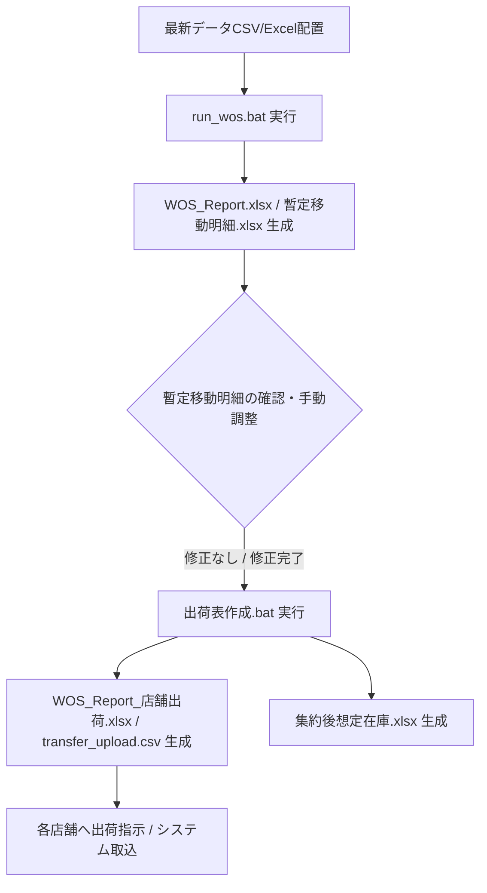

# WOS（在庫日数）アイテム集約ツール — 総合仕様・業務マニュアル

本ドキュメントは、「WOS アイテム集約ツール」の最新仕様、計算ロジック、データ連携、画面の見方、各種帳票書類、および運用手順をまとめた総合マニュアルです。

---

## 1. システム概要と目的

本ツールは、全国のリテール直営店舗の売上履歴・現在庫・商品マスタ・発注数データを多角的に分析し、**店舗間の在庫偏りを平準化して全社売上の最大化と在庫消化を促進する「アイテム移動推奨リスト」および「店舗別出荷指示書」「システム取込用CSV」を自動生成するシステム**です。

### 🌟 主な特徴
1. **WOS（在庫日数/週数）に基づく科学的な在庫平準化**: 直近4週間の販売スピード（週販）と手元在庫から、過不足のない適正移動数を算出。
2. **全期間週販によるフォールバック補完**: 直近4週売上ゼロでも全期間に月1点以上の売上実績があればWOSを自動補完し、デッドストックの滞留を防止。
3. **消化率による2層集約（優先/通常）**: 消化率 ≥ 80% の商品は完売を狙う「⭐ 優先集約」、それ以外は「📦 通常集約」に自動分類。
4. **次シーズン継続品の色分け**: 次期（例: 26FW）発注がある継続品を行全体で青色ハイライト（🔄 バッジ付き）。
5. **自社BULK（倉庫）在庫の可視化**: 出荷予定振分の自社フリー在庫を明記し、在庫あり（>0）セルを黄色ハイライト（⚠️ 店舗間移動より倉庫出荷を優先検討可能）。
6. **作業用マトリクス（暫定移動明細）と手動調整**: 店舗間移動を横持ちマトリクスで俯瞰・調整でき、合計不一致の自動アラートやセルコメントによる個別集約先指定に対応。
7. **近隣配送コスト最小化アルゴリズム**: エリア間距離（同一エリア ➔ 隣接エリア ➔ 遠隔エリア ➔ 北海道）を考慮し、最も配送コストが低くなる店舗ペアへ優先配分。
8. **大分類（Apparel / Hardwear）対応の出荷指示書**: 店舗別出荷指示Excel（サマリー・店舗別シート）および基幹システム取込用CSVをワンクリックで生成。

---

## 2. 参照ファイル（入力データ）一覧

ツール実行時、フォルダ内の最新ファイルを**キーワードで自動検出**します（引数での手動指定も可能）。

| ファイル種別 | 自動検索キーワード | 対象列・主な参照データ | 役割 |
|:---|:---|:---|:---|
| **売上データ** | `営業日付別売上分析` (.csv) | 列[1]:日付, 列[2]:店舗, 列[3]:SKU, 列[4]:ブランド, 列[6]:商品名, 列[8]:カラー, 列[10]:売上数 | 過去4週平均週販および累計売上数の算出 |
| **在庫データ** | `在庫一覧` (.csv) | 列[1]:店舗, 列[2]:SKU, 列[7]:ブランド, 列[17]:現在数量（R列） | 各店舗の手元現在庫数の取得 |
| **商品マスタ** | `商品マスタ` (.csv) | 列[0]:SKU, 列[3]:商品名, 列[5]:カラー名, 列[6]:大分類(Apparel/Hardwear等) | 正式商品名・カラー・大分類の補完 |
| **発注数データ** | `FRV` かつ `発注数` (.xlsx) | 1列目: SKU, 12列目: 発注計（L列） | 消化率（累計売上 ÷ 発注数）の算出 |
| **次期発注数データ** | `FW` かつ `発注数` (.xlsx) | 1列目: SKU, 12列目: 発注計（L列） | 次シーズン継続品（🔄）の判定 |
| **出荷予定振分** | `出荷予定振分` (.csv) | 4行目以降, D列(列[3]): SKU, **H列(列[7]): 納品先BULK** | 自社リテール専用BULK（倉庫）フリー在庫数の取得 |

---

## 3. 計算ロジックと業務ルール

### 3.1 フィルタリング・除外ルール
- **ブランド制限**: `FJALLRAVEN` のみ対象。
- **KANKEN除外**: SKUが `23510` で始まる定番KANKENは集約対象外。
- **Tokyo限定品除外**: 商品名に `Tokyo` を含む限定品は対象外。
- **除外店舗**:
  - `6142`, `FJALLRAVEN by 3NITY`（全社売上・消化率計算には含め、店舗移動対象外）
  - `New Way`, `ZOZO`, `丸井`, `ユニフォーム`, `バルク（倉庫）`, `テスト店舗` 等は移動対象から自動除外。

### 3.2 WOS（Weeks of Supply: 在庫週数）
$$\text{WOS (週数)} = \frac{\text{現在庫数量}}{\text{直近4週間の平均週販}}$$
※ 直近28日間の売上がない店舗は WOS = NaN（集約の基準WOSから除外）。

#### 3.2.1 フォールバックWOS（全期間平均週販ベース）
直近4週に売上がなくても、**全期間（期初〜最新日付）の平均週販が月1点以上**（`avg_sales_full >= 0.25`/週）ある店舗×SKUは、フォールバックWOSを使って移動推奨に含める。

$$\text{フォールバックWOS} = \frac{\text{現在庫数量}}{\text{全期間平均週販}}$$

- 🟠 **レポートでの識別**: 移動推奨テーブルの左端にオレンジ枠、理由列に `(参考)` を表示。
- 月1点未満の超低速品（`avg_sales_full < 0.25`）はフォールバック対象外（ノイズ除去）。

### 3.3 消化率と優先度判定
$$\text{全社消化率 (\%)} = \min\left(100.0, \frac{\text{全期間累計売上数}}{\text{発注総数}} \times 100\right)$$
- **⭐ 優先集約**: 消化率 ≥ 80%（完売狙い）
- **📦 通常集約**: 消化率 < 80% または発注データなし

### 3.4 移動推奨数の算出とマッチングループ
1. 各SKUの「全店平均WOS」（通常WOS + フォールバックWOS の有効店舗で算出）を基準とし、
   - **出荷候補店舗 (shippers)**: $\text{WOS} > \text{全店平均WOS}$（余剰あり）
   - **受入候補店舗 (receivers)**: $\text{WOS} < \text{全店平均WOS}$（不足あり）
2. **余剰数・不足数の計算**:
   - $\text{余剰数 (surplus)} = \text{現在庫} - (\text{平均WOS} \times \text{週販})$
   - $\text{不足数 (deficit)} = (\text{平均WOS} \times \text{週販}) - \text{現在庫}$
3. **受入店舗のソート優先順位**:
   - **第1キー**: 不足数（`deficit`）の降順（必要度が大きい店舗を最優先）
   - **第2キー（同点時タイブレーカー）**: 店舗優先順位ランク（昇順）
     1. TOKYO / 2. ルクア大阪 / 3. 名古屋 / 4. TOKYO NODE / 5. 京王新宿 / 6. 大丸心斎橋 / 7. 玉川高島屋 / 8. SAPPORO HUTTE / 9. NARITA
4. **実在庫上限ガード**:
   - $\text{移動推奨数} = \min(\lceil\min(\text{surplus}, \text{deficit})\rceil, \text{出荷元の手元現在庫})$
   - 1点移動するごとに手元在庫と余剰から移動数を引き、手元在庫が 0 になった店舗からの出荷は即座に終了。
   - **「出荷元在庫」列は各移動時点の実在庫**（同一出荷元から複数受入へ移動する際も、行ごとに正確な在庫数を表示）。

---

## 4. 出力書類・帳票一覧

本システムが生成する帳票・データファイル一覧です。

| 出力ファイル名 | 種別 | 主な内容・用途 |
|:---|:---:|:---|
| **`WOS_Report.xlsx`** | メインExcel | ⭐優先集約リスト、📦通常集約リスト、店舗別WOSサマリー、生データ、📋全店現在庫一覧 |
| **`WOS_全店在庫一覧.xlsx`** | コピー用Excel | 全店舗×全SKUの現在庫、週販、WOS、消化率、集約先/受入元情報を網羅 |
| **`WOS_Report.html`** | Webダッシュボード | ブラウザで高速検索・フィルタリング・閲覧可能なインタラクティブレポート |
| **`暫定移動明細.xlsx`** | 作業用マトリクス | 全店舗の「現在庫」「ORDER」「集約後想定在庫」「在庫日数」を横持ちで一覧。手動調整・コメント記入・整合性チェック用 |
| **`WOS_Report_店舗出荷.xlsx`** | 店舗別出荷指示書 | 9×9出荷サマリーマトリクス、大分類別サマリー、統合移動明細、および各店舗別の出荷指示シート |
| **`transfer_upload.csv`** | 取込用CSV | 基幹システムへ一括インポート可能な縦持ちCSV（大分類、移動元、移動先、商品コード、数量、理由） |
| **`集約後想定在庫.xlsx`** | シミュレーションExcel | 暫定移動明細の移動完了後における各店舗の想定在庫数・在庫日数を計算した一覧 |

---

## 5. 業務運用手順



### ステップ1: WOS計算と暫定明細の生成
1. フォルダ内に最新の `営業日付別売上分析.csv`、`在庫一覧.csv`、`商品マスタ.csv`、`発注数.xlsx`、`出荷予定振分.csv` を配置します。
2. **`run_wos.bat`** をダブルクリック（または `python run.py`）。
3. `WOS_Report.xlsx` や `暫定移動明細.xlsx` が自動生成されます。

### ステップ2: 暫定移動明細の確認・調整（必要時）
- `暫定移動明細.xlsx` を開き、必要に応じて「ORDER」列の数値を調整します。
- 特定の店舗へ送りたい場合は、セルのコメントに「TOKYO」「ルクア」等の受入希望店舗名を記入可能。
- 出荷合計と受入合計が不一致の場合、A列（商品コード）が赤くハイライトされるため安心です。

### ステップ3: 出荷指示書・システム取込CSVの生成
1. **`出荷表作成.bat`** をダブルクリック（または `python src/generate_shipping_list.py`）。
2. 近隣配送コスト最小化＆コメント指定を反映した **`WOS_Report_店舗出荷.xlsx`** と **`transfer_upload.csv`** が生成されます。
3. 必要に応じて `python src/create_post_transfer_stock.py` を実行し、**`集約後想定在庫.xlsx`** で移動後の在庫バランスを確認します。

---

## 6. コマンドライン引数（上級者向け）

```bash
# WOS計算・レポート生成
python run.py --sales "売上.csv" --stock "在庫.csv" --master "商品マスタ.csv" --order "発注.xlsx" --next-order "次期発注.xlsx" --ship-alloc "出荷振分.csv" --threshold 80.0

# 出荷表・CSV生成
python src/generate_shipping_list.py --input "暫定移動明細.xlsx" --master "商品マスタ.csv" --output-csv "transfer_upload.csv" --output-xlsx "WOS_Report_店舗出荷.xlsx"

# 集約後想定在庫生成
python src/create_post_transfer_stock.py
```
